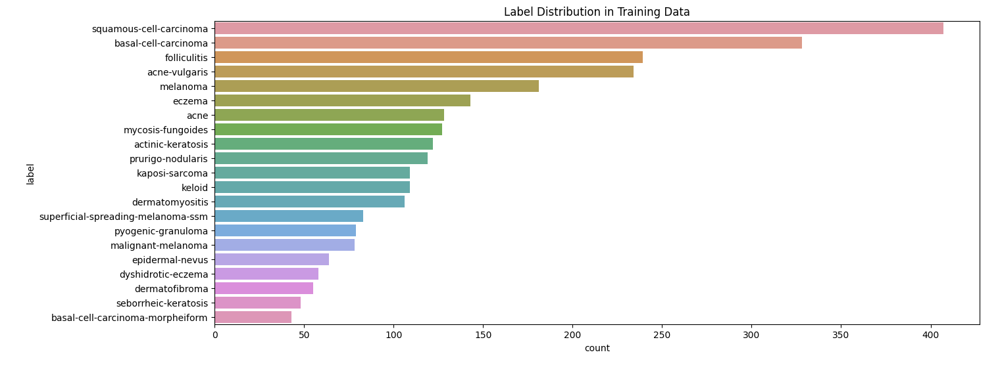
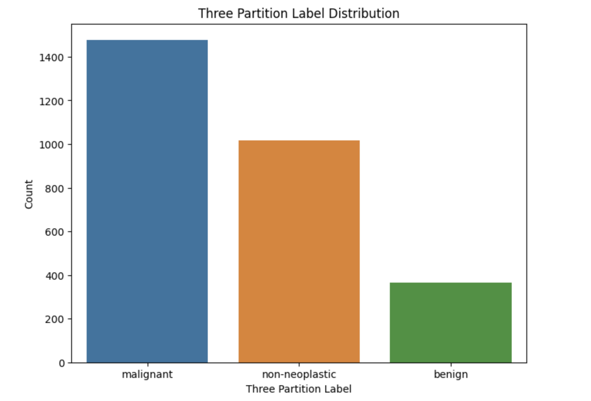
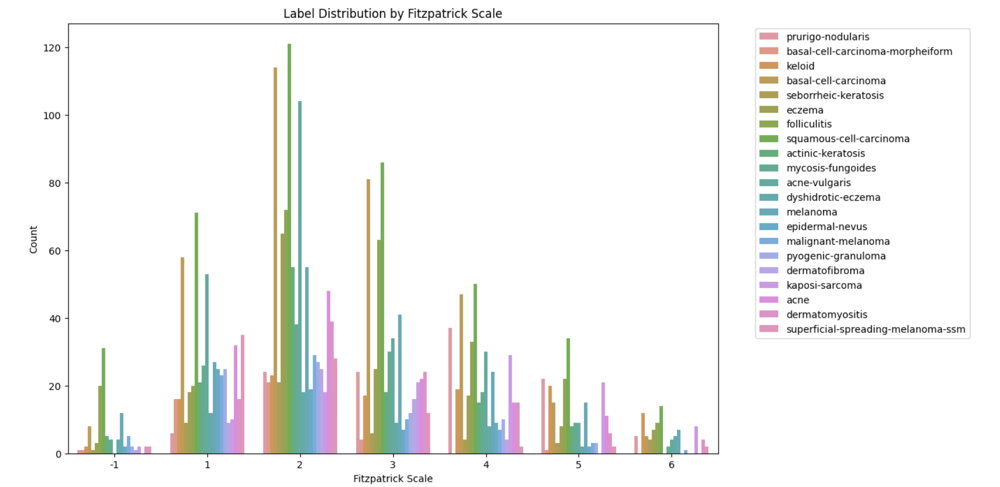

Equitable AI for Dermatology

⚠️ _Remember to update the above title and remove all guidance notes and examples in this template, before finalizing your README_

---

| Name | GitHub Handle | Contribution |
| ----- | ----- | ----- |
| Maya Swan | [@msmayaswan](https://github.com/msmayaswan) | Performed EDA, built inital model |
| Julia Husainzada | [@juliahusainzada](https://github.com/juliahusainzada) | Performed EDA, performed data augmentation |
| Isabella Alfaro | [@IsabellaAlfaro](https://github.com/IsabellaAlfaro) | Finetuned Xception model, improved accuracy score |
| Be-Once' Marsh | [@beonce](https://github.com/beonce) | Handled missing data |
| Michelle Cao | [@mcao694](https://github.com/mcao694) | Finetuning model | 

---

## **🎯 Project Highlights**

**Example:**

Built an Xception model using transfer learning and fine-tuning to accomplish the tas of building an ML model to classify skin conditions across diverse skin tones.
* Ranked 21st on the final Kaggle Leaderboard with a F1 score of 0.55188
* Used Tensorflow to interpret model decisions and improve performance
* Implemented data preprocessing to optimize results within compute constraints

🔗 [Equitable AI for Dermatology | Kaggle Competition Page](https://www.kaggle.com/competitions/bttai-ajl-2025/overview)

---

## **👩🏽‍💻 Setup & Execution**

**Provide step-by-step instructions so someone else can run your code and reproduce your results. Depending on your setup, include:**

* How to clone the repository
* How to install dependencies
* How to set up the environment
* How to access the dataset(s)
* How to run the notebook or scripts

---

## **🏗️ Project Overview**

Describe:
Our project is part of a Kaggle competition connected to the Break Through Tech AI Program, which focuses on advancing diversity and inclusion in artificial intelligence. This competition challenges participants to develop equitable AI solutions that address real-world biases in machine learning.

The Objective of the Challenge:
The goal of this challenge is to build a machine learning model that can accurately classify skin conditions across diverse skin tones. By ensuring that the model performs well across different skin types, we aim to create a more inclusive AI system that does not disproportionately favor lighter skin tones, a common issue in existing dermatology AI models.

Real-World Significance and Impact:
Skin condition detection plays a critical role in healthcare, influencing early diagnosis and treatment outcomes. However, AI models in dermatology often lack diverse training data, leading to biased predictions that fail to serve underrepresented populations. By participating in this challenge, we contribute to advancing equity in AI by developing a model that centers on those historically excluded in medical AI applications. Our work has the potential to improve access to accurate dermatological assessments for all individuals, regardless of their skin tone.

---

## **📊 Data Exploration**

**Describe:**

* The dataset is a subset of the FitzPatrick17k dataset, a labeled collection of about 17,000 images depicting a variety of serious (e.g., melanoma) and cosmetic (e.g., acne) dermatological conditions with a range of skin tones scored on the FitzPatrick skin tone scale (FST). About 4500 images are in this set, representing 21 skin conditions out of the 100+ in the full FitzPatrick set.

* The data exploration and preprocessing involved loading the dataset from CSV files, creating full file paths for images by combining the label and md5hash columns, and encoding the categorical label column into numerical values using LabelEncoder(). Additionally, the dataset was split into 80% for training and 20% for validation. These steps helped prepare the data for use in training a machine learning model while ensuring compatibility and efficiency in the process.

### ⚖️ Label Distribution in Training Data: Skin Condition Sample Count
*Displays the number of training images per skin condition (x-axis: image count, y-axis: conditions sorted by frequency).*

**Insights**: 
* **Class Imbalance:** Dominant classes (e.g., squamous-cell-carcinoma) vastly outnumber rarer ones (e.g., basal-cell-carcinoma-morpheaform).
* **Model Impact:** An imbalanced dataset may bias the model toward well-represented classes, reducing accuracy for underrepresented labels.
* **Healthcare Implications:** Underrepresentation could lead to misdiagnoses in real-world scenarios if not properly addressed.

### ⚖️ Three Partition Distribution
*Displays how many images exist per Fitzpatrick skin tone (x-axis) and diagnosis label (color/hue).*

**Insights**: 
* There are far more images for lighter skin tones (e.g., scale 2 or 3) than darker tones (e.g., scale 5 or 6). This imbalance can cause the model to perform better on lighter tones and poorly on darker ones, potentially perpetuating healthcare disparities.
* Addressing underrepresentation is crucial for fairness and reducing misdiagnosis in darker skin tones; this can be achieved through targeted data augmentation, balanced sampling, and model adjustments like class weighting and fine-tuning.

### ⚖️ Fitzpatrick Scale Distribution
*Compares the counts of images grouped into three overarching diagnostic categories—malignant, non-neoplastic, and benign.* 

**Insights:**
* **Imbalance in Samples:** Malignant conditions dominate, followed by non-neoplastic, with benign conditions being the least represented.
* **Model Bias:** A model may learn to better detect malignant features, reducing accuracy for benign and non-neoplastic conditions.
* **Clinical Implications:** Misclassification can lead to unnecessary treatments or missed diagnoses, impacting patient care.
* **Mitigation Strategies:** Use data augmentation, class weighting, or collect more benign samples to balance the dataset and improve model performance.

---

## **🧠 Model Development**

### **Base Model:**  
* **Xception Network** pre-trained on ImageNet (fine-tuned end-to-end).  

### **Custom Classification Head:**  
* **Global Average Pooling** layer.  
* **Fully Connected Layer**: 1024 units, ReLU activation.  
* **L2 Weight Regularization** (λ=0.01) to mitigate overfitting.  
* **50% Dropout** for improved generalization.  
* **Softmax Output Layer** (114 classes).  

### ⚙️ Training Configuration  
### **Optimization Setup:**  
* **Optimizer**: Adam (initial LR = 1e-4).  
* **Loss Function**: Sparse Categorical Crossentropy.  
* **Learning Rate Scheduling**: ReduceLROnPlateau (factor=0.2, patience=3).  
* **Early Stopping**: Monitored validation loss (patience=5, restores best weights).  

### **Regularization Strategy:**  
* **L2 Weight Decay** (λ=0.01).  
* **Dropout (50%)** in the classification head.  

### 📊 Training Performance  
### **Dataset Configuration:**  
* **Training/Validation Split**: 80% / 20% (stratified sampling).  
* **Batch Size**: 32.  
* **Training Epochs**: 20 (early stopping applied).  

### **Model Performance:**  
* **Training Accuracy**: 100%
* **Validation Accuracy**: ~58%

---

## **📈 Results & Key Findings**

**Describe (as applicable):**

* Performance metrics (e.g., Kaggle Leaderboard score, F1-score)
* How your model performed overall
* How your model performed across different skin tones (AJL)
* Insights from evaluating model fairness (AJL)

**Potential visualizations to include:**

* Confusion matrix, precision-recall curve, feature importance plot, prediction distribution, outputs from fairness or explainability tools

---

## **🖼️ Impact Narrative**

**Answer the relevant questions below based on your competition:**

**AJL challenge:**

As Dr. Randi mentioned in her challenge overview, “Through poetry, art, and storytelling, you can reach others who might not know enough to understand what’s happening with the machine learning model or data visualizations, but might still be heavily impacted by this kind of work.”
As you answer the questions below, consider using not only text, but also illustrations, annotated visualizations, poetry, or other creative techniques to make your work accessible to a wider audience.
Check out [this guide](https://drive.google.com/file/d/1kYKaVNR\_l7Abx2kebs3AdDi6TlPviC3q/view) from the Algorithmic Justice League for inspiration!

1. What steps did you take to address [model fairness](https://haas.berkeley.edu/wp-content/uploads/What-is-fairness_-EGAL2.pdf)? (e.g., leveraging data augmentation techniques to account for training dataset imbalances; using a validation set to assess model performance across different skin tones)
2. What broader impact could your work have?

---

## **🚀 Next Steps & Future Improvements**

**Address the following:**

* What are some of the limitations of your model?
* What would you do differently with more time/resources?
* What additional datasets or techniques would you explore?

---

## **📄 References & Additional Resources**

* Cite any relevant papers, articles, or tools used in your project

